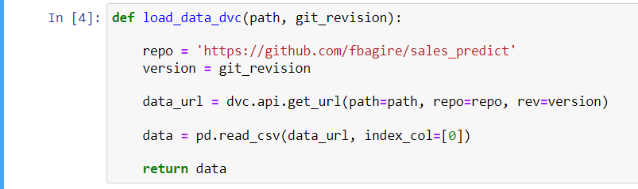
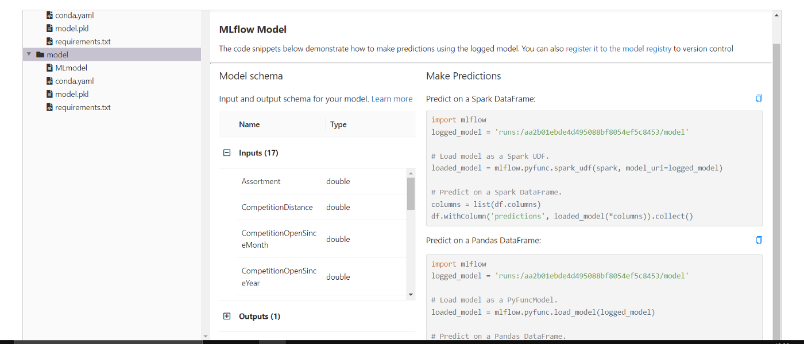
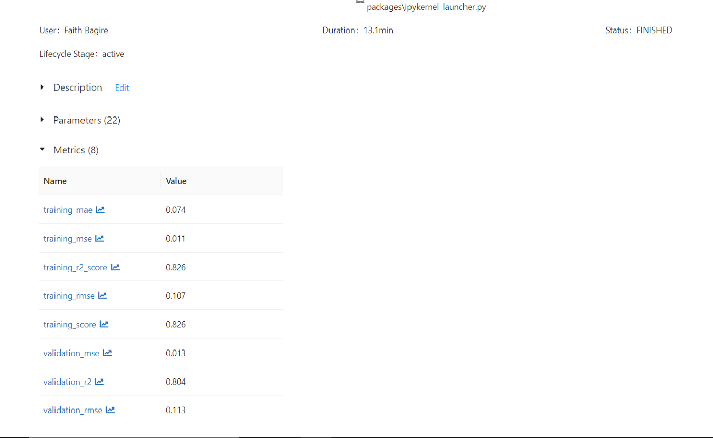
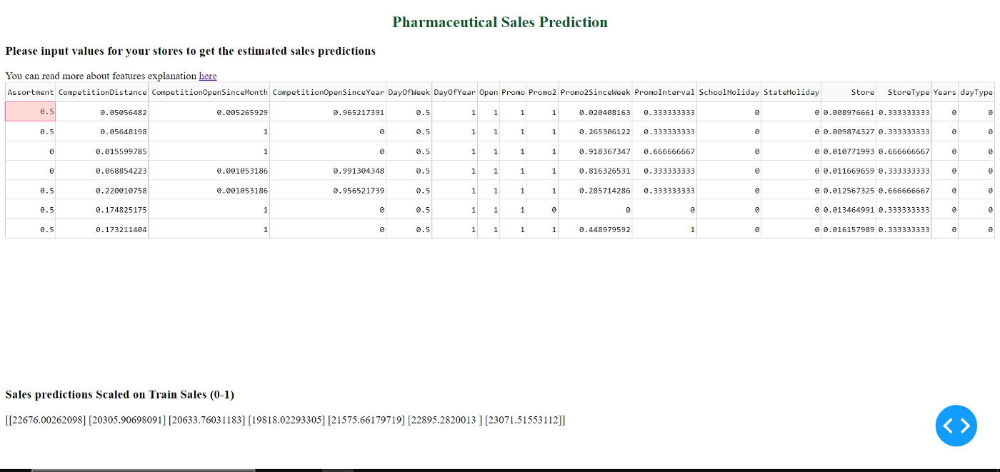

## Pharmaceutical Sales prediction across multiple stores

In sales department, We would like to use factors such as promotions, competition, school and state
holidays, seasonality, and locality as necessary to predicting the sales across the various stores.

This repo contains full code for this project where we provide 6 weeks forecast of sales.

MLOps with DVC, CML, and MLFlow was followed for this project.

### Data and overview

The data team identified factors such as promotions, competition, school and state holidays,
seasonality, and locality as necessary for predicting the sales across the various stores. Our task
will be to build and serve an end-to-end product that delivers this prediction to analysts in the
finance team. The dataset for this task can be found on Kaggle here AS the data might get bigger
while altering and saving back to csv locally, I shall use DVC to versioning and control the
datasets, and they can be pulled from time to time with just 3 lines of code without having them
locally.

#### Read Data

DVC is used to remotely store data and with correct credentials, a user can pull data locally as they please

#### Model Saving using MLflow

#### Serving Predictions using Plotly Dashboard

### Clone the Project

git clone hhttps://github.com/fbagire/pharmaceutical_sales_forecast.git\
cd pharmaceutical_sales_forecast\
pip install -r docs/requirements.txt